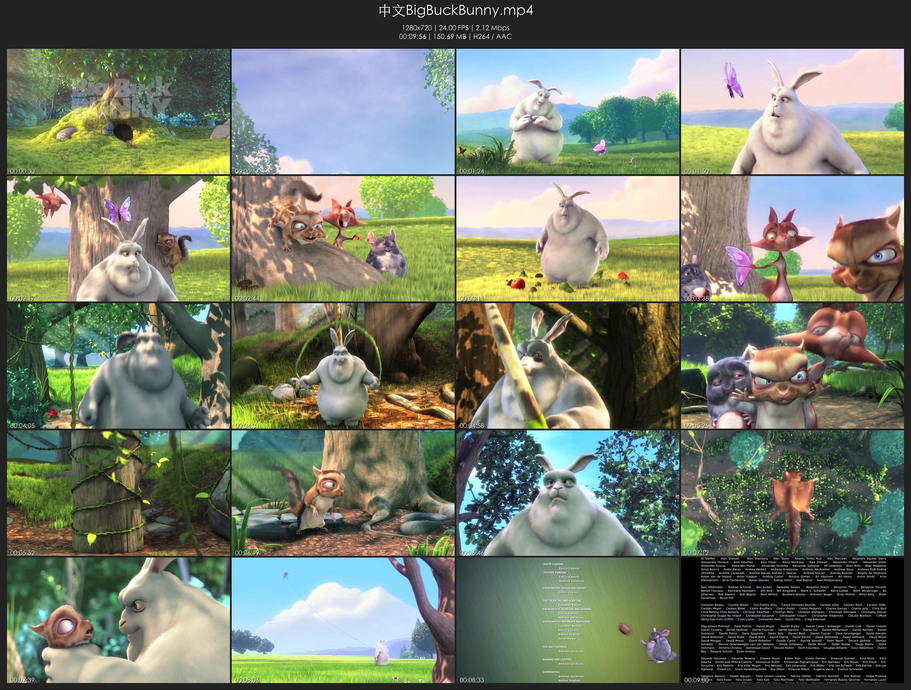
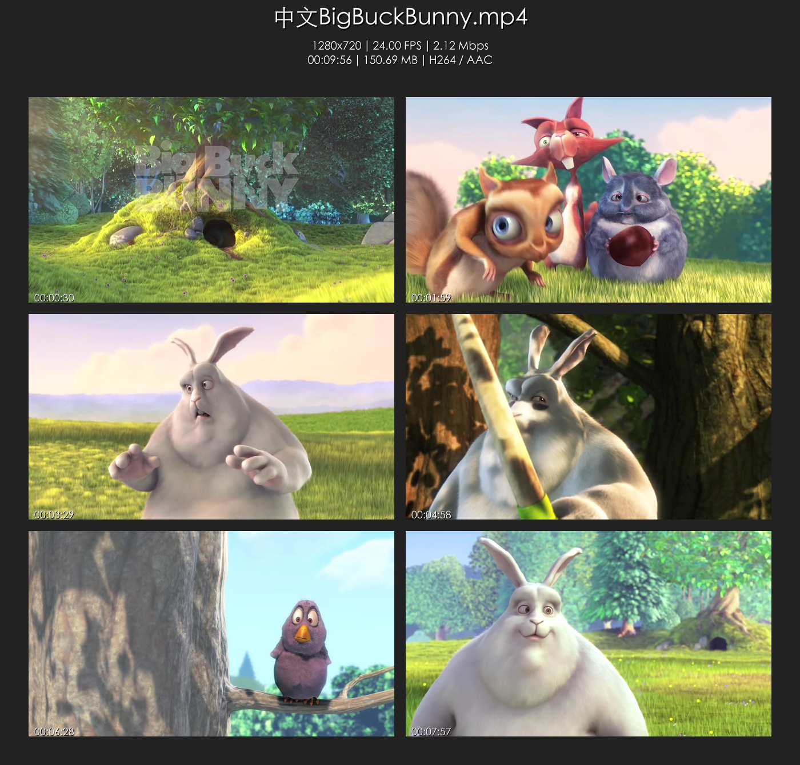

# MontageGo

[](https://golang.org)
[](LICENSE)
[](https://github.com/xi-mad/MontageGo/releases)

---

`MontageGo` 是一个现代化、快速、可配置的命令行工具，用于为视频生成缩略图拼贴图（Thumbnail Sheet）。

与直接拼装复杂的 FFmpeg 滤镜不同，MontageGo 采用“计算时间点 → 精确取帧 → 内存合成”的高性能流程：
- 使用 `ffprobe` 解析元数据并计算需要的帧时间点（默认跳过开头/结尾 5%）。
- 通过 `ffmpeg` 在这些时间点快速抽帧并按目标尺寸缩放（`image2pipe` + `mjpeg`），零磁盘中间文件。
- 使用 `github.com/fogleman/gg` 在内存中合成网格、背景与标题文字，直接输出最终图片。

## ✨ 特性亮点
- **高性能**：仅取必要帧，内存管线避免磁盘 I/O，高并发抽帧。
- **智能取帧**：在中间 90% 内容均匀抽帧，避免片头/片尾无效画面。
- **自动排版**：根据行列、缩略图尺寸、内外边距与标题高度，自动计算整体画布。
- **信息抬头**：可渲染文件名、分辨率、帧率、码率、时长、大小与编码信息。
- **可配置**：支持命令行参数与 `--config config.yaml` 配置文件，CLI 优先级更高。
- **流式输出**：支持 `-o -` 将 JPEG 直接写到 stdout，便于与其他工具管道组合。

## 🧩 依赖
请确保系统已安装：
- `ffmpeg`
- `ffprobe`

可通过 `--ffmpeg-path` 与 `--ffprobe-path` 指定可执行路径，否则默认使用 PATH 中的二进制。

## 🔧 从源码构建
```bash
# 克隆
git clone https://github.com/xi-mad/MontageGo.git
cd MontageGo

# 单平台构建
go build -o MontageGo ./cmd/montagego

# 跨平台构建（生成 builds/ 产物）
./scripts/build.sh
```

## 🚀 快速开始
```bash
# 生成默认 4x5 拼贴
./MontageGo "my video.mp4"

# 自定义布局与背景色
./MontageGo "my video.mp4" -c 5 -r 6 --thumb-width 400 --bg-color "#eeeeee" \
  --font-color "#333333" -o "~/Desktop/my_montage.jpg"

# 流式输出到 stdout，并在 macOS 预览中打开
./MontageGo "my video.mp4" -q -o - | open -a Preview.app -f
```

## 🖼 示例效果

<a href="tests/outputs/test_01_default.jpg"></a>

更多布局与参数效果：

- 2x3 布局（大间距与外边距）

<a href="tests/outputs/test_02_layout_2x3.jpg"></a>

- 自定义颜色

<a href="tests/outputs/test_05_colors.jpg"></a>

更多示例请查看目录：[`tests/outputs/`](tests/outputs/)

## 📄 使用配置文件（--config）
支持通过 `--config config.yaml` 加载配置（CLI > 配置文件 > 默认值）。示例：
```yaml
# config.yaml 示例
output_path: ""
ffmpeg_path: "ffmpeg"
ffprobe_path: "ffprobe"

columns: 4
rows: 5
thumb_width: 480
thumb_height: -1      # -1 表示按宽高比自适应高度
padding: 8
margin: 24
header_height: 120

font_file: "/System/Library/Fonts/STHeiti Light.ttc"
font_color: "white"
shadow_color: "black"
background_color: "#222222"
jpeg_quality: 2       # 1-31，数值越小质量越高

quiet: false
verbose: false
show_app_log: true
show_ffmpeg_log: true
```
使用方式：
```bash
./MontageGo tests/videos/中文BigBuckBunny.mp4 --config config.yaml
# CLI 参数可覆盖配置文件中的同名项
./MontageGo tests/videos/中文BigBuckBunny.mp4 --config config.yaml -c 3 -r 3
```

## 🧪 测试脚本
项目提供覆盖常见参数组合的测试脚本：
```bash
./scripts/run_tests.sh
# 输入视频默认从 tests/videos/中文BigBuckBunny.mp4 读取
# 输出图片写入 tests/outputs/
```

## 🔠 命令行选项
| 短标志 | 长标志            | 描述                                                         | 默认值                     |
|--------|-------------------|--------------------------------------------------------------|----------------------------|
| `-o`   | `--output`        | 输出路径。用 `-` 将图像数据输出到 stdout。                 | `[输入文件名]_montage.jpg` |
| `-c`   | `--columns`       | 网格列数                                                     | `4`                        |
| `-r`   | `--rows`          | 网格行数                                                     | `5`                        |
|        | `--thumb-width`   | 每个缩略图宽度                                               | `640`                      |
|        | `--thumb-height`  | 每个缩略图高度。`-1` 表示按宽高比自适应                     | `-1`                       |
|        | `--padding`       | 缩略图之间的间距（像素）                                     | `5`                        |
|        | `--margin`        | 网格距离画布边缘的外边距（像素）                             | `20`                       |
|        | `--header`        | 顶部标题区域高度（像素）                                     | `120`                      |
|        | `--font-file`     | 文本渲染 `.ttf` 字体文件路径（不提供则不渲染文字）          | (无)                       |
|        | `--font-color`    | 主字体颜色                                                   | `white`                    |
|        | `--shadow-color`  | 文本阴影颜色                                                 | `black`                    |
|        | `--bg-color`      | 背景颜色                                                     | `#222222`                  |
|        | `--jpeg-quality`  | JPEG 输出质量 (1-31，数值越小质量越高)                       | `2`                        |
|        | `--ffmpeg-path`   | `ffmpeg` 可执行路径                                           | `ffmpeg`                   |
|        | `--ffprobe-path`  | `ffprobe` 可执行路径                                          | `ffprobe`                  |
|        | `--config`        | YAML 配置文件路径                                            | (无)                       |
| `-q`   | `--quiet`         | 静默模式，隐藏程序与 FFmpeg 日志                              | `false`                    |
| `-v`   | `--verbose`       | 详细模式，打印将要执行的完整 FFmpeg 命令                      | `false`                    |
|        | `--show-app-log`  | 是否显示程序日志                                              | `true`                     |
|        | `--show-ffmpeg-log`| 是否显示 FFmpeg 实时输出                                      | `true`                     |

> 颜色支持标准 6 位十六进制（`#RRGGBB`）及常见颜色名（如 `black`、`white`、`navy` 等）。

## 📦 构建与发布
- 构建所有平台产物（并将示例配置复制到 `builds/config.sample.yaml`）：
  ```bash
  ./scripts/build.sh
  # 产物位于 builds/
  ```
- 创建与推送标签（可触发你的发布流程）：
  ```bash
  ./scripts/release.sh vX.Y.Z "Release notes"
  ```

## 🧭 工作原理（宏观）
1. `ffprobe` 获取时长、分辨率、码率、帧率与编解码信息。
2. 根据行列数在 5%-95% 区间均匀取样时间戳。
3. 并发执行 `ffmpeg`：`-ss <ts> -vf scale=<w>:<h> -vframes 1 -f image2pipe -c:v mjpeg pipe:1`，将 JPEG 数据直接写入内存。
4. 在 Go 端解码 JPEG 并使用 `gg` 绘制背景、标题与网格排布，写出最终 JPEG。

## 🤝 贡献
欢迎提交 Issue 或 PR 改进功能、性能与可用性！

## 📄 许可证
本项目基于 [MIT License](LICENSE) 授权。
